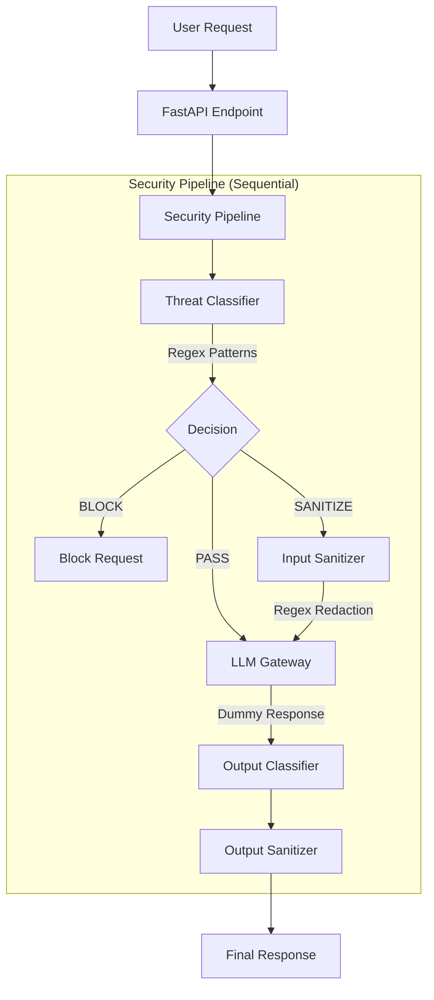

# VeilArmor - A LLM Security Framework
Veil Armor is an enterprise-grade security framework for Large Language Models (LLMs) that provides multi-layered protection against prompt injections, jailbreaks, PII leakage, and sophisticated attack vectors.

## Key Features

- Prompt Injection Detection - Real-time detection using Vigil TransformerScanner
- Jailbreak Prevention - 30+ custom regex patterns for bypasses Vigil misses
- PII Protection - Microsoft Presidio integration for sensitive data detection
- Real-time Security API - FastAPI-powered RESTful endpoints
- Kubernetes Ready - Health checks, metrics, and deployment manifests included
- Docker Support - Multi-stage production builds

## Architecture

### Technical Architecture
```rust
┌─────────────────────────────────────────────────────────────────┐
│                        YOUR REQUEST                             │
│                                                                 │
│  POST /api/v1/process                                           │
│  {                                                              │
│    "prompt": "Your question here",                              │
│    "user_id": "optional_user_id"                                │
│  }                                                              │
└─────────────────────────────────────────────────────────────────┘
                              │
                              ▼
┌─────────────────────────────────────────────────────────────────┐
│                     VEILARMOR PIPELINE                          │
│                                                                 │
│  1. CLASSIFY → Detect threats (injection, jailbreak, PII)       │
│  2. DECIDE   → BLOCK / SANITIZE / PASS                          │
│  3. PROCESS  → Send to LLM (if not blocked)                     │
│  4. ANALYZE  → Check LLM response for leaks                     │
└─────────────────────────────────────────────────────────────────┘
                              │
                              ▼
┌─────────────────────────────────────────────────────────────────┐
│                        RESPONSE                                 │
│                                                                 │
│  {                                                              │
│    "success": true/false,                                       │
│    "action": "PASS" / "SANITIZE" / "BLOCK",                     │
│    "response": "LLM response or null if blocked",               │
│    "threats_detected": ["PROMPT_INJECTION", ...],               │
│    "severity": "NONE" / "LOW" / "MEDIUM" / "HIGH" / "CRITICAL"  │
│  }                                                              │
└─────────────────────────────────────────────────────────────────┘
```
### Component Architecture


## Requirements
- Python 3.11+
- Docker (optional, for containerized deployment)

## Installation

For the installation process, please follow the INSTALL.md file.
