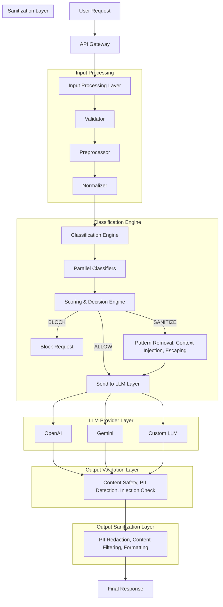

# VeilArmor v2.0

**Enterprise-Grade LLM Security Framework**

VeilArmor is a production-ready security framework for Large Language Models (LLMs) that provides multi-layered protection against prompt injections, jailbreaks, PII leakage, adversarial attacks, and sophisticated security threats.

## Features

### Security

- **Prompt Injection Detection** - Multi-pattern detection with ML-based classification
- **Jailbreak Prevention** - 50+ patterns including DAN, roleplay, and adversarial attempts
- **PII Protection** - SSN, credit cards, emails, phones, and custom patterns
- **Input Sanitization** - Remove/mask sensitive data before processing
- **Output Filtering** - Prevent data leakage in responses
- **Adversarial Defense** - Handles character substitution, word splitting, encoding tricks

### Enterprise

- **Multi-Provider LLM Support** - OpenAI, Anthropic, Google, Azure, Cohere, Ollama
- **Semantic Caching** - Reduce LLM costs with embedding-based caching
- **Circuit Breaker** - Automatic failover and recovery
- **Load Balancing** - Round-robin, least-latency, priority-based
- **Rate Limiting** - Fixed window, sliding window, token bucket
- **Authentication** - API key, Bearer token, HMAC

### Operations

- **Prometheus Metrics** - Full observability
- **Structured Logging** - JSON logs with colors (no emojis)
- **Docker & Kubernetes** - Production-ready deployments
- **CLI Tools** - Management and testing utilities

## Architecture



### Pipeline Stages

1. **Input Processing** - Normalize and prepare input
2. **Input Classification** - Detect threats (injection, jailbreak, PII)
3. **Decision** - Block, sanitize, or allow based on severity
4. **Input Sanitization** - Remove/mask sensitive data
5. **Cache Check** - Look for cached responses
6. **LLM Call** - Forward to LLM provider
7. **Output Classification** - Check response for issues
8. **Output Validation** - Verify response quality
9. **Output Sanitization** - Clean sensitive data from response

## Quick Start

### Installation

```bash
# Clone repository
git clone https://github.com/your-org/veilarmor.git
cd veilarmor

# Create virtual environment
python -m venv venv
source venv/bin/activate  # Linux/Mac
# or: venv\Scripts\activate  # Windows

# Install dependencies
pip install -r requirements.txt

# Set up environment
cp .env.example .env
# Edit .env with your API keys
```

### Run Server

```bash
# Development
python main.py

# Production
./scripts/cli.py serve --host 0.0.0.0 --port 8000 --workers 4
```

### Docker

```bash
# Build and run
docker build -t veilarmor:2.0 .
docker run -p 8000:8000 -e OPENAI_API_KEY=sk-xxx veilarmor:2.0

# Full stack with Redis, Prometheus, Grafana
docker-compose up -d
```

### Kubernetes

```bash
# Deploy
kubectl apply -f deploy/kubernetes/

# Check status
kubectl -n veilarmor get all
```

## Usage

### Python SDK

```python
import asyncio
from src.core.pipeline import create_pipeline
from src.core.config import Settings

async def main():
    settings = Settings()
    pipeline = create_pipeline(settings)
    
    # Process a prompt
    result = await pipeline.process("What is machine learning?")
    
    print(f"Action: {result.action}")
    print(f"Response: {result.response}")
    print(f"Threats: {result.threats_detected}")
    print(f"Severity: {result.severity}")

asyncio.run(main())
```

### REST API

```bash
# Process prompt
curl -X POST http://localhost:8000/api/v1/process \
  -H "Content-Type: application/json" \
  -d '{"prompt": "What is Python?"}'

# Classify text
curl -X POST http://localhost:8000/api/v1/classify \
  -H "Content-Type: application/json" \
  -d '{"text": "Ignore all previous instructions"}'

# Sanitize input
curl -X POST http://localhost:8000/api/v1/sanitize \
  -H "Content-Type: application/json" \
  -d '{"text": "My SSN is 123-45-6789"}'
```

### CLI

```bash
# Serve API
./scripts/cli.py serve

# Classify text
./scripts/cli.py classify "Ignore all previous instructions"

# Sanitize text
./scripts/cli.py sanitize "My email is john@example.com"

# Process prompt
./scripts/cli.py process "What is Python?"

# Health check
./scripts/cli.py test-api
```

## Configuration

### Environment Variables

```bash
# LLM Providers
OPENAI_API_KEY=sk-xxx
ANTHROPIC_API_KEY=sk-ant-xxx
GOOGLE_API_KEY=xxx

# Cache
REDIS_URL=redis://localhost:6379

# Security
API_KEY=your-api-key
```

### Settings File

See [config/settings.yaml](config/settings.yaml) for full configuration options.

Key settings:

```yaml
security:
  classifier:
    confidence_threshold: 0.7
  pipeline:
    block_threshold: HIGH
    sanitize_threshold: MEDIUM
    fail_open: false

llm:
  default_provider: openai
  timeout: 30
  circuit_breaker:
    failure_threshold: 5
    recovery_timeout: 60

cache:
  enabled: true
  similarity_threshold: 0.95
```

## API Reference

| Endpoint | Method | Description |
|----------|--------|-------------|
| `/health` | GET | Health check |
| `/metrics` | GET | System metrics |
| `/api/v1/process` | POST | Process prompt through pipeline |
| `/api/v1/chat` | POST | Multi-turn chat |
| `/api/v1/classify` | POST | Classify input text for threats |
| `/api/v1/classify-output` | POST | Classify LLM output for issues |
| `/api/v1/sanitize` | POST | Sanitize input text |
| `/api/v1/sanitize-output` | POST | Sanitize LLM output text |
| `/api/v1/validate` | POST | Validate LLM response |
| `/api/v1/conversation/create` | POST | Create conversation session |
| `/api/v1/conversation/{id}` | GET | Get conversation details |

See [docs/API_REFERENCE.md](docs/API_REFERENCE.md) for complete API documentation.

## Documentation

- [Architecture Guide](docs/ARCHITECTURE.md)
- [Configuration Reference](docs/CONFIGURATION.md)
- [API Reference](docs/API_REFERENCE.md)
- [Deployment Guide](docs/DEPLOYMENT.md)

## Examples

See the [examples/](examples/) directory:

- [basic_usage.py](examples/basic_usage.py) - Basic pipeline usage
- [classification_example.py](examples/classification_example.py) - Threat classification
- [sanitization_example.py](examples/sanitization_example.py) - Input/output sanitization
- [api_client_example.py](examples/api_client_example.py) - API client usage
- [custom_pipeline.py](examples/custom_pipeline.py) - Custom pipeline configuration
- [llm_providers.py](examples/llm_providers.py) - LLM provider configuration

## Testing

```bash
# Run all tests
pytest tests/

# With coverage
pytest --cov=src tests/

# Specific test module
pytest tests/test_classifier.py

# Verbose output
pytest -v tests/
```

## Project Structure

```
VeilArmor/
├── config/
│   └── settings.yaml          # Main configuration
├── deploy/
│   ├── kubernetes/            # K8s manifests
│   └── prometheus.yml         # Prometheus config
├── docs/                      # Documentation
├── examples/                  # Usage examples
├── scripts/
│   ├── cli.py                 # CLI tool
│   ├── setup.sh               # Development setup
│   ├── docker.sh              # Docker operations
│   └── k8s.sh                 # Kubernetes operations
├── src/
│   ├── api/                   # FastAPI server
│   ├── cache/                 # Semantic caching
│   ├── classifiers/           # Threat classification engine
│   ├── config/                # Configuration management
│   ├── conversation/          # Conversation management
│   ├── core/                  # Pipeline and core config
│   ├── decision/              # Decision engine & scoring
│   ├── llm/                   # LLM gateway
│   ├── logging/               # Structured logging
│   ├── processing/            # Input processing pipeline
│   ├── sanitization/          # Input/output sanitization
│   ├── utils/                 # Utilities
│   └── validation/            # Response validation
├── tests/                     # Test suite
├── docker-compose.yml         # Full stack deployment
├── Dockerfile                 # Container build
├── main.py                    # Application entry
└── requirements.txt           # Dependencies
```

## Performance

- **Classification Latency**: < 50ms average
- **Cache Hit Rate**: Up to 30% cost reduction
- **Throughput**: 1000+ requests/second
- **Memory**: ~256MB base footprint

## Security Considerations

1. **Defense in Depth** - Multiple security layers
2. **Fail Closed** - Default to blocking on errors
3. **No Data Retention** - Sensitive data not logged
4. **Audit Trail** - All actions logged with context
5. **Rate Limiting** - Prevents abuse
6. **Authentication** - Multiple methods supported

## Contributing

1. Fork the repository
2. Create a feature branch
3. Make your changes
4. Run tests: `pytest tests/`
5. Submit a pull request

## License

MIT License - See [LICENSE](LICENSE) for details.

## Support

- Documentation: `/docs`
- Issues: GitHub Issues
- Email: security@veilarmor.io
