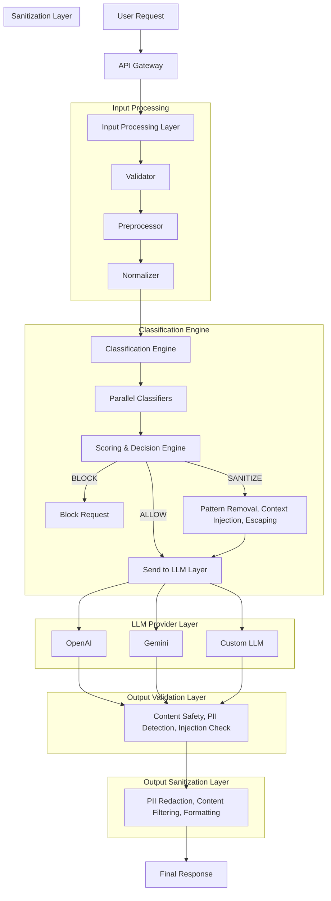

# VeilArmor - Architecture Guide

## Overview

VeilArmor is an enterprise-grade LLM security framework that provides multi-layered protection against prompt injections, jailbreaks, PII leakage, and other security threats.

## System Architecture


## Core Components

### 1. API Gateway (`src/api/`)

The API gateway handles all incoming requests with:

- **Rate Limiting**: Configurable strategies (fixed window, sliding window, token bucket)
- **Authentication**: Multiple methods (API key, Bearer token, HMAC)
- **Request Tracking**: Unique request IDs and telemetry
- **Security Headers**: CORS, CSP, and other security headers

### 2. Security Pipeline (`src/core/pipeline.py`)

The pipeline orchestrates all security stages:

```python
# 9-stage pipeline
STAGES = [
    "input_processing",      # Normalize and prepare input
    "input_classification",  # Detect threats
    "decision",              # Block, sanitize, or allow
    "input_sanitization",    # Clean PII, URLs, etc.
    "cache_check",           # Semantic cache lookup
    "llm_call",              # Forward to LLM provider
    "output_classification", # Check response for issues
    "output_validation",     # Validate response quality
    "output_sanitization",   # Clean sensitive data
]
```

### 3. Classification Engine (`src/classifiers/`)

Multi-layered threat detection with parallel execution:

- **Pattern Matching**: Regex-based detection for known attacks
- **ML Classification**: Statistical models for nuanced detection
- **Adversarial Detection**: Handles obfuscation attempts
- **Threat Categories**: 
  - Prompt Injection
  - Jailbreak Attempts
  - PII Detection
  - Harmful Content
  - Sensitive Data

### 4. Sanitization (`src/sanitization/`)

Input and output cleaning:

- **PII Removal**: SSN, credit cards, emails, phones
- **URL Filtering**: Removes potentially malicious URLs
- **Unicode Normalization**: Handles encoding tricks
- **Content Filtering**: Removes sensitive patterns

### 5. LLM Gateway (`src/llm/`)

Enterprise-grade LLM integration:

- **Multi-Provider**: OpenAI, Anthropic, Google, Azure, Cohere, Ollama
- **Circuit Breaker**: Protects against provider failures
- **Load Balancing**: Round-robin, random, least-latency, priority
- **Retry Logic**: Configurable retry with exponential backoff

### 6. Semantic Cache (`src/cache/`)

Intelligent response caching:

- **Embedding-Based**: Uses sentence-transformers for similarity
- **Similarity Threshold**: Configurable (default 0.95)
- **TTL Support**: Time-based expiration
- **Redis Backend**: Distributed caching option

### 7. Validation Engine (`src/validation/`)

Response quality assurance:

- **Length Validation**: Min/max response length
- **Content Rules**: Forbidden patterns, required content
- **Format Validation**: JSON, structured responses
- **Safety Checks**: Harmful content detection
- **Quality Metrics**: Coherence, relevance scoring

## Data Flow

### Request Processing

1. **Receive**: Client sends request to API gateway
2. **Authenticate**: Validate API key or token
3. **Rate Check**: Verify rate limits
4. **Process Input**: Normalize and prepare
5. **Classify**: Detect threats in input
6. **Decide**: Block, sanitize, or allow
7. **Sanitize Input**: Remove PII if needed
8. **Cache Check**: Look for similar cached responses
9. **LLM Call**: Forward to LLM provider (if not cached)
10. **Classify Output**: Check response for issues
11. **Validate**: Verify response quality
12. **Sanitize Output**: Clean sensitive data
13. **Return**: Send response to client

### Severity Levels

```python
class Severity(Enum):
    NONE = "NONE"         # No threat detected
    LOW = "LOW"           # Minor concern
    MEDIUM = "MEDIUM"     # Needs sanitization
    HIGH = "HIGH"         # Should be blocked
    CRITICAL = "CRITICAL" # Immediate block
```

### Actions

```python
class Action(Enum):
    ALLOW = "ALLOW"       # Pass through unchanged
    PASS = "PASS"         # Same as ALLOW
    SANITIZE = "SANITIZE" # Clean and forward
    BLOCK = "BLOCK"       # Reject request
```

## Configuration

### Environment Variables

```bash
# Core
VEILARMOR_ENV=production
VEILARMOR_DEBUG=false
VEILARMOR_LOG_LEVEL=INFO

# LLM Providers
OPENAI_API_KEY=sk-xxx
ANTHROPIC_API_KEY=sk-ant-xxx
GOOGLE_API_KEY=xxx

# Cache (Redis)
REDIS_URL=redis://localhost:6379

# Security
API_KEY=your-api-key
JWT_SECRET=your-jwt-secret
```

### Pipeline Configuration

```python
config = PipelineConfig(
    enable_input_processing=True,       # Run input validation/normalization
    enable_input_classification=True,   # Run threat classifiers
    enable_input_sanitization=True,     # Sanitize input if needed
    enable_cache=True,                  # Use semantic cache
    enable_output_classification=True,  # Check LLM output
    enable_output_validation=True,      # Validate output quality
    enable_output_sanitization=True,    # Clean output PII/creds
    fail_open=False,                    # Block on errors
    timeout_seconds=30.0,               # Pipeline timeout
)
```

## Deployment

### Docker

```bash
docker build -t veilarmor:2.0 .
docker run -p 8000:8000 veilarmor:2.0
```

### Kubernetes

```bash
kubectl apply -f deploy/kubernetes/
```

### Monitoring

- **Prometheus**: Metrics at `/metrics`
- **Grafana**: Dashboard visualization
- **Structured Logging**: JSON logs with context

## Security Considerations

1. **Defense in Depth**: Multiple layers of protection
2. **Fail Closed**: Default to blocking on errors
3. **No Data Retention**: Sensitive data not logged
4. **Audit Trail**: All actions logged with context
5. **Rate Limiting**: Prevents abuse
6. **Authentication**: Multiple methods supported

## Performance

- **Average Latency**: <50ms for classification
- **Cache Hit Rate**: Up to 30% reduction in LLM calls
- **Throughput**: 1000+ requests/second
- **Horizontal Scaling**: Kubernetes HPA support
